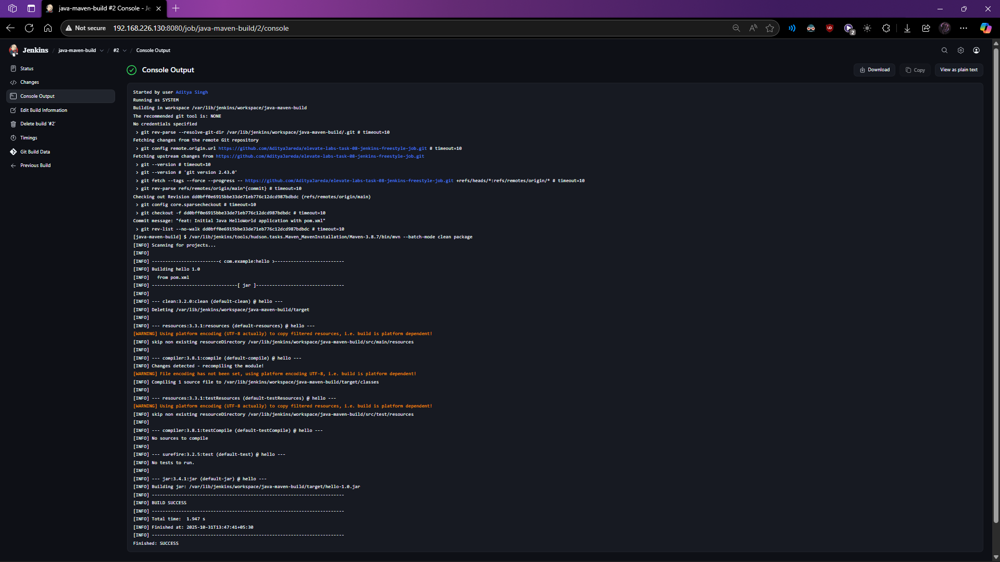

# Day 8: Building a Java Application with Jenkins and Maven

This project demonstrates a classic Continuous Integration (CI) setup using a **Jenkins Freestyle project** to build a simple Java "Hello World" application with **Apache Maven**.

The goal of this task was to understand the fundamentals of a Jenkins job, how Jenkins integrates with build tools like Maven, and how to configure a build without using a scripted `Jenkinsfile`.

## Key Concepts

*   **Jenkins Freestyle Project:** This is the original, UI-driven way of creating a job in Jenkins. Instead of writing a pipeline script, all configuration—from source code management to build steps—is done through web forms, dropdowns, and checkboxes. It's excellent for straightforward, single-purpose jobs.

*   **Apache Maven:** A powerful build automation and project management tool for Java. It manages a project's dependencies, compiles the source code, and packages it into a distributable format (like a `.jar` file). All instructions for Maven are defined in the `pom.xml` file.

## Project Files

*   **`pom.xml`:** The Project Object Model file. It tells Maven the project's metadata and how to build it. In this case, it's configured to use the `maven-compiler-plugin` to compile Java 1.8 compatible code.
*   **`src/main/java/HelloWorld.java`:** The simple Java application source code that prints "Hello, Jenkins + Maven!" to the console.

## Jenkins Configuration Steps

1.  **Global Tool Configuration:** First, I configured the necessary tools in Jenkins under `Manage Jenkins > Global Tool Configuration`.
    *   **JDK:** Added an installation for OpenJDK 11, specifying its `JAVA_HOME` on the Jenkins server.
    *   **Maven:** Added a Maven installation and configured it to be installed automatically by Jenkins.

2.  **Freestyle Project Creation:** I created a new "Freestyle project" named `java-maven-build`.

3.  **Source Code Management:** In the job configuration, I linked the project to this GitHub repository by providing its HTTPS URL. Jenkins was configured to pull from the `main` branch.

4.  **Build Step:** I added a build step of the type "Invoke top-level Maven targets".
    *   **Maven Version:** I selected the Maven version I had configured in the global tools.
    *   **Goals:** I specified the goals `clean package`. This tells Maven to first delete any previous build artifacts and then compile and package the application into a `.jar` file.

## Build Success: Console Output

After saving the configuration, I manually triggered the build using the "Build Now" button. The screenshot below shows the successful console output from the Jenkins build, which is the key deliverable for this task. It shows Jenkins checking out the code from Git, invoking Maven, and completing the build successfully.

